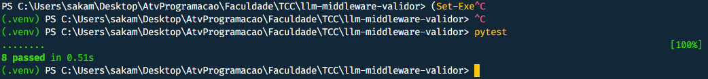

# ADR 0001 — Pipeline de detectores com nucleo isolado

**Status:** Aceito
**Data:** 03/09/2026

## Contexto
O middleware inspeciona cada prompt em tres dimensoes (PII, injection,
orcamento) sob limite de 15ms de latencia adicionada. A avaliacao exige
executar essa logica milhares de vezes para apurar percentis, o que é
inviavel se ela so rodar dentro do contexto de nuvem.

## Decisao
O pacote 'core/' nao importa 'fastapi', 'boto3' nem 'httpx', essas
dependencias ficam em grupos opcionais do 'pyproject.toml'. Cada detector
implementa o protocolo 'inspect(text, config) -> list[Finding]' e apenas
reporta ocorrencias, traduzir ocorrencias em ação ('ALLOW'/'SANITIZE'/
'BLOCK') cabe somente ao orquestrador. A decisao usa pontuacao continua
comparada a um limiar externalizado, e nao regra booleana.

Descartou-se classificacao por LLM secundaria (custo e latencia
incompativeis com os objetivos do trabalho) e modelo de ML local
(nao determinismo e perda de explicabilidade do bloqueio).

## Consequencias
O nucleo passa a ser mensuravel isoladamente e as camadas podem ser
desligadas uma a uma para atribuir latencia a cada uma. Limiares sao
varridos experimentalmente sem tocar em código. Em contrapartida, a
deteccao deterministica nao generaliza para ataques ineditos, limite que
precisa constar na secao de limitacoes da monografia.

## Teste do dia:

